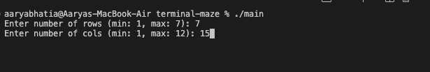
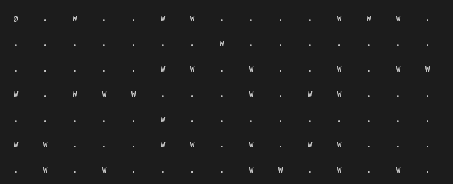

# Terminal Maze Game

## Installation

Prerequisites

- MacOS: `brew install ncurses`
- Linux: `sudo apt-get install libncurses-dev`

Build and Run
```
make
./main
```

## Instructions

- Cells marked with 'W' are walls.
- Cells marked with '.' are part of the path.
- Cell marked with '@' is player position.
- Press q to quit game.
- Press arrow keys or hjkl to move player.
- Move player to bottom right of maze to win.

## Screenshot




